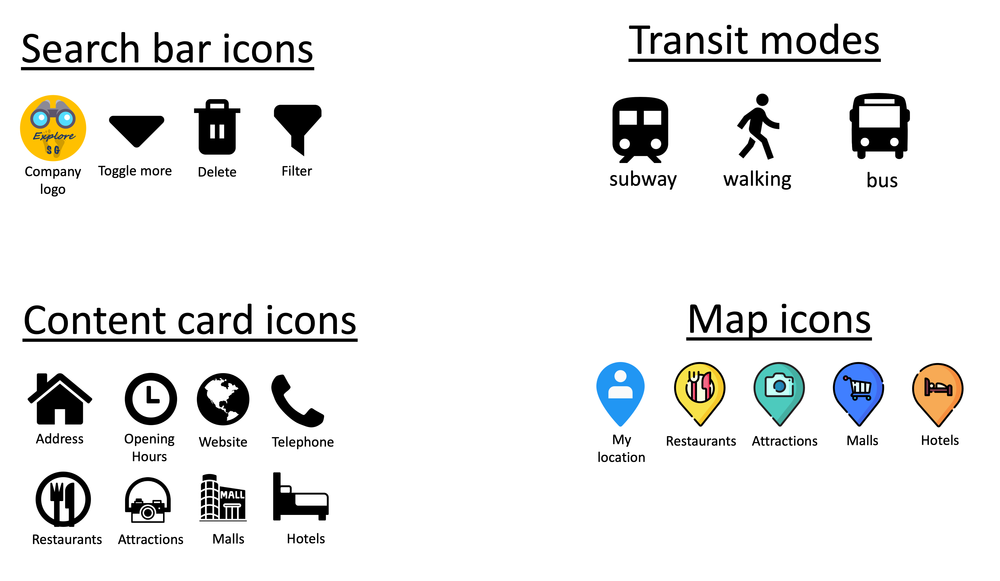

<h1>Explore SG</h1>

The live demo of the website can be accessed <a href="https://exploresg.netlify.app/">here</a>

<h2>1. Project Summary</h2>

<h3>1.1 Project Context</h3>

As the tourism industry is anticipating a influx of foreign visitors following the relaxation of covid measures. Foreign visitors are eager to explore both the iconic landmarks, shopping and food that Singapore has to offer. Many rely on word of mouth and social media to research for the most authentic spots to visit.

<h3>1.2 Organisation Goals</h3>

Explore SG is a map application that aims to help foreign visitors to search for the most popular shopping, food and landmarks to visit in Singapore, and provide navigation directions by public transport.

<h3>1.3 Target Audience</h3>

Foreign visitors who want to explore popular shopping, food and landmarks by public transport.

<h2>2. UIUX</h2>

<h3>2.1 Strategy</h3>
<h4>2.1.1 Organisation Objective</h4>

<h4>2.1.2 User Stories</h4>
User Story: 
User is a tourist on a free and easy package, spending around 3 to 5 days in Singapore.
Th

<h3>2.2 Scope</h3>
<h4>2.2.1 Features</h4>
<ol>
    <li>Allow the user to search for locations, organised according to different categories (shopping malls, restaurants, hotels, attractions)</li>
    <li>Search can either be for the whole of Singapore, or limited to 3km radius around the user's current position</li>
    <li>User should be able to filter the returned results according to which category is of interest to them</li>
    <li>User should be able to access key information (photo, opening hours, address, website) about each location</li>
    <li>User should be able to set a location as a start or end point, and generate a navigation route and instructions to reach there by public transport</li>
</ol>

<h4>2.2.2 Content</h4>
Content for the website will be pulled from the following sources:
<ul>
    <li>Foursquare (location details, photos, opening hours, address, website)</li>
    <li>Singapore Tourism Board (navigation route, turn by turn instructions)</li>
    <li>OpenStreetMap (map body)</li>
</ul>

<h4>2.2.3 Non-functional Requirements</h4>
The website should be designed with a mobile first template, and should be mobile responsive to be used for phones, tablets and laptops.

<h3>2.3 Site Interaction Architecture</h3>

<h3>2.4 Skeleton</h3>
 

<h3>2.5 Surface</h3>
<h4>2.5.1 Colors</h4>

 The above color scheme was chosen as blue and orange tones convey vibrancy and warmth, resembling the sunshine and clear skies. This makes it suitable for a tourism related use case.

<h4>2.5.2 Fonts</h4>

A sans serif font with a small font size was chosen to create the an uncluttered, minimalist look and feel to enhance the user experience on the website

<h4>2.5.3 Icons and Markers</h4>

<h2>3. Features</h2>

Based on the features defined above, the application should be able to:
<ol>
    <li>Allow the user to search for locations, organised according to different categories (shopping malls, restaurants, hotels, attractions)</li>
    <li>Search can either be for the whole of Singapore, or limited to 3km radius around the user's current position</li>
    <li>User should be able to filter the returned results according to which category is of interest to them</li>
    <li>User should be able to access key information (photo, opening hours, address, website) about each location</li>
    <li>User should be able to set a location as a start or end point, and generate a navigation route and instructions to reach there by public transport</li>
</ol>

<h3>3.2 Limitations and Future Implementations</h3>
<table>
    <tr>
        <th>No.</th>
        <th>Limitations</th>
        <th>Future Implementations</th>
    </tr>
    <tr>
        <td>1</td>
        <td>User is currently restricted to searching for the following categories on Foursquare's API (19014 hotel, 17114 shopping mall, 16007 landmarks, 13034 cafe, 13035 coffeeshop, 13340 singapore restaurant, 13145 fastfood, 13099 chinese, 13299 malay, 13199 indian)</td>
        <td>Future move to Google's API to return a wider array of results with higher consistency in data </td>
    </tr>
    <tr>
        <td>2</td>
        <td>Current navigation route only returns result via "transit" mode of transport</td>
        <td>User to be able to select between driving, transit, cycling and walking modes of transport</td>
    </tr>
    <tr>
        <td>3</td>
        <td>Current transit only returns 1 option for public transport. In reality there are multiple combinations of buses and trains available to the user.</td>
        <td>Search to be able to return several transit options for user to decide, along with being able to see the arrival timings of buses and trains at any given bus stop.</td>
    </tr>
    <tr>
        <td>4</td>
        <td>Navigation route generated is currently focused on helping the user to get from start point to end point, rather than explore the island</td>
        <td>Navigation results to be able to suggest points of interest along the way between the start point and end point to facilitate tourists to maximise their itinerary to see as much of Singapore as possible</td>
    <tr>
        <td>5</td>
        <td>Search results return only basic location details</td>
        <td>Search results to return more details such as reviews and ratings, busy hours, and photos submitted by other users</td>
    </tr>
    <tr>
        <td>6</td>
        <td>Search data is currently done via 2 api separate api calls directly from Foursquare. It is not possible to migitate any empty data fields, or allow user to save favourite locations separate from the search results</td>
        <td>Extract and combine all required data into an array for better customisation. Push location objects that are tagged as user favourites into a separate array so that user can clear the map without losing these locations</td>
    </tr>

</table>

<h2>4. Test Cases</h2>

The test list can be accessed <a href="https://1drv.ms/x/s!ArFMW1hSgH5_gacFMFkKcplOkPmMzw?e=MIYanj">here</a>.

<h2>5. Deployment</h2>

The deployment is done through netlify with the following <a href="https://docs.google.com/document/d/1PSqdn83kqyb-gNUeU33ushxpeTWM8b032278DYn7IqE/edit?usp=sharing">instructions</a>.

<h2>6. Technologies Used</h2>

<table>
    <tr>
        <th>Technology</th>
        <th>Usage</th>
    </tr>
    <tr>
        <td>HTML,CSS,JS,Bootstrap5</td>
        <td>Building and styling the main layout and user interactions on the website.</td>
    </tr>
    <tr>
        <td>JS</td>
        <td>Geolocation function to return user current latitude and longitude. Decoder for encoded polyline. Other custom functions.</td>
    </tr>
    <tr>
        <td>Leaflet</td>
        <td>Create map and markers. Support for markercluster and markercluster layering.</td>
    </tr>
    <tr>
        <td>OpenStreetMap</td>
        <td>Main map layer used</td>
    </tr>
    <tr>
        <td>AXIOS</td>
        <td>Call APIs</td>
    </tr>
    <tr>
        <td>Foursquare Places API</td>
        <td>Allow user to search for location and location details</td>
    </tr>
    <tr>
        <td>Singapore Tourism Board Maps API</td>
        <td>Navigation routing and turn by turn instructions</td>
    </tr>
</table>

<h2>7. Credits</h2>

<a href="https://developer.foursquare.com/docs/api-explorer">Foursquare Places API</a>: Location searches

<a href="https://tih-dev.stb.gov.sg/map-api/apis/get/v1.1/experiential_route/%7Bmode%7D">Singapore Tourism Board Map API</a>: Navigation route and instructions

<a href="https://www.flaticon.com/">Flaticon</a>: Icons and markers used throughout the website

Github user <a href="https://github.com/ghybs/Leaflet.MarkerCluster.LayerSupport">ghybs</a>: Template for marker cluster layering support

Github user <a href="https://github.com/jieter/Leaflet.encoded">jieter</a>: JS for decoding encoding polyline