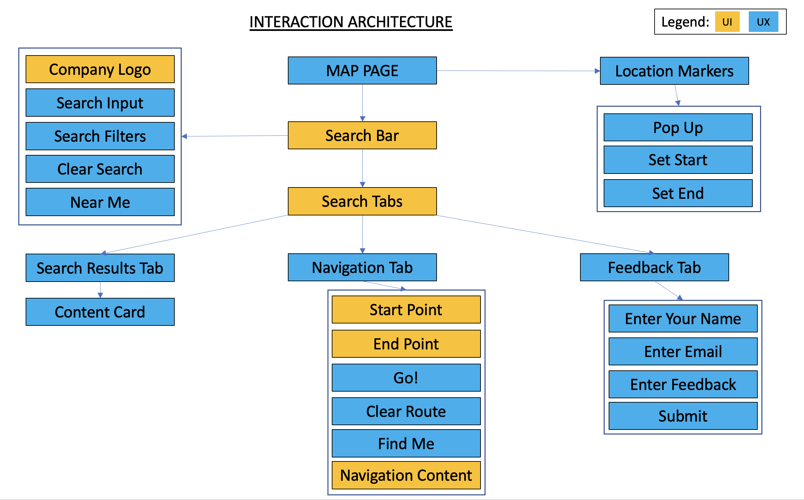
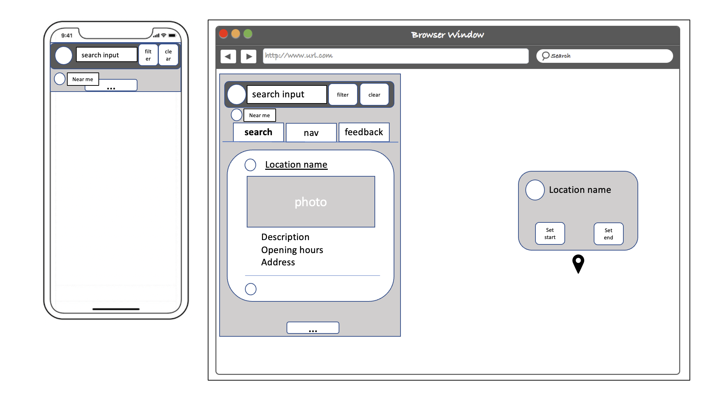
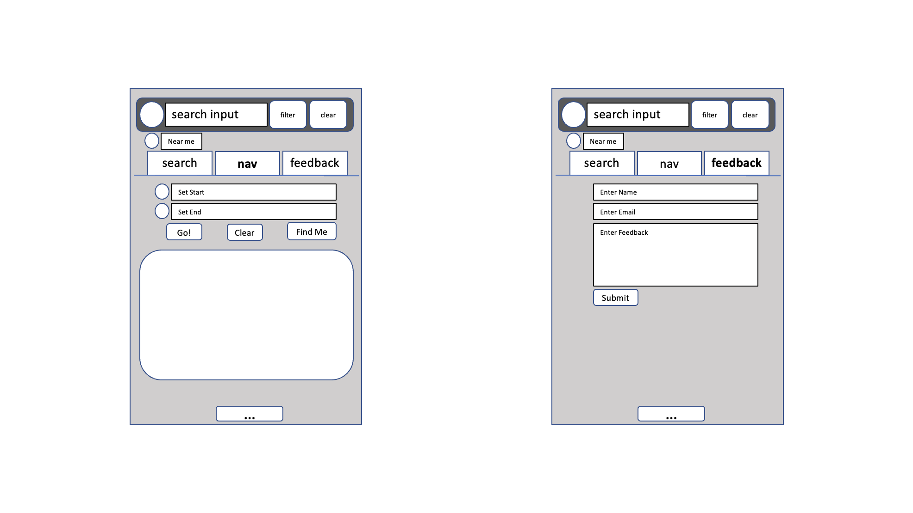
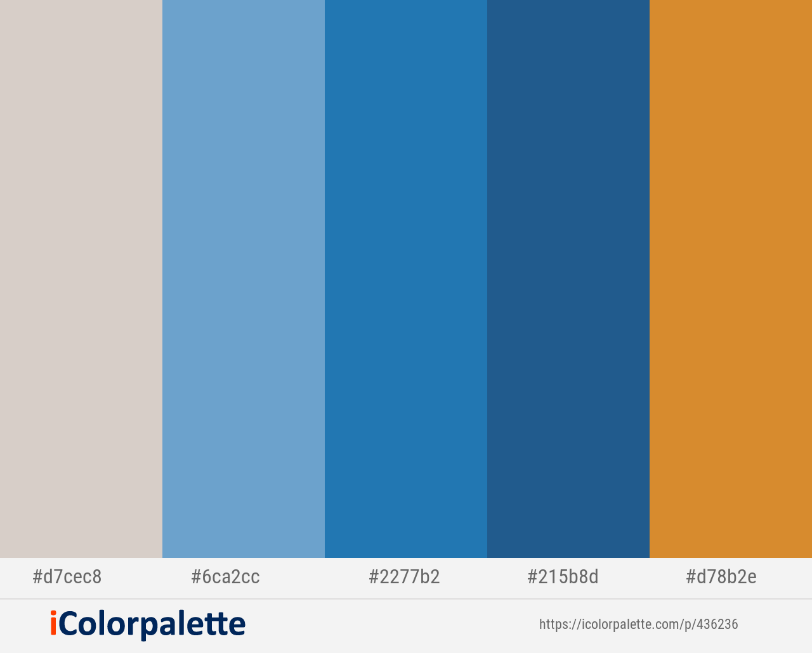

<h1>Explore SG</h1>

<!-- holding picture of different layouts -->
The live demo of the website can be accessed <a href="https://stupendous-donut-1d1c52.netlify.app/">here</a>

<h2>1. Project Summary</h2>

<h3>1.1 Project Context</h3>

As the tourism industry is anticipating a influx of foreign visitors following the relaxation of covid measures. Foreign visitors are eager to explore both the iconic landmarks, shopping and food that Singapore has to offer. Many rely on word of mouth and social media to research for the most authentic spots to visit.

<h3>1.2 Organisation Goals</h3>

Explore SG is a map application that aims to help foreign visitors to search for the most popular shopping, food and landmarks to visit in Singapore, and provide navigation directions by public transport.

<h3>1.3 Target Audience</h3>

Foreign visitors who want to explore popular shopping, food and landmarks by public transport.

<h2>2. UIUX</h2>

<h3>2.1 Strategy</h3>
<h4>2.1.1 Organisation Objective</h4>

<h4>2.1.2 User Stories</h4>
User Story: 
User is a tourist on a free and easy package, spending around 3 to 5 days in Singapore.
Th

<h3>2.2 Scope</h3>
<h4>2.2.1 Features</h4>
<ol>
    <li>Allow the user to search for locations, organised according to different categories (shopping malls, restaurants, hotels, attractions)</li>
    <li>Search can either be for the whole of Singapore, or limited to 3km radius around the user's current position</li>
    <li>User should be able to filter the returned results according to which category is of interest to them</li>
    <li>User should be able to access key information (photo, opening hours, address, website) about each location</li>
    <li>User should be able to set a location as a start or end point, and generate a navigation route and instructions to reach there by public transport</li>
</ol>

<h4>2.2.2 Content</h4>
Content for the website will be pulled from the following sources:
<ul>
    <li>Foursquare (location details, photos, opening hours, address, website)</li>
    <li>Singapore Tourism Board (navigation route, turn by turn instructions)</li>
    <li>OpenStreetMap (map body)</li>
</ul>

<h4>2.2.3 Non-functional Requirements</h4>
The website should be designed with a mobile first template, and should be mobile responsive to be used for phones, tablets and laptops.

<h3>2.3 Site Interaction Architecture</h3>

<h3>2.4 Skeleton</h3>
 

<h3>2.5 Surface</h3>
<h4>2.5.1 Colors</h4>

 The above color scheme was chosen as blue and orange tones convey vibrancy and warmth, resembling the sunshine and clear skies. This makes it suitable for a tourism related use case.

<h4>2.5.2 Fonts</h4>

A sans serif font with a small font size was chosen to create the an uncluttered, minimalist look and feel to enhance the user experience on the website

<h4>2.5.3 Icons and Markers</h4>

<h2>3. Features</h2>

table of features
<h3>3.2 Limitations and Future Implementations</h3>

<h2>4. Test Cases</h2>

The test list can be accessed <a href="https://1drv.ms/x/s!ArFMW1hSgH5_gacFMFkKcplOkPmMzw?e=MIYanj">here</a>.

<h2>5. Deployment</h2>

The deployment is done through netlify with the following <a href="">instructions</a>.

<h2>6. Technologies Used</h2>

<h2>7. Credits</h2>

Scope
This application aims to help visitors search for information and locations of national parks and nature trails in Singapore, and provide navigation instructions to reach those locations via a variety of travel modes (walking, cycling and public transit)

Features
User should be able to search for specific locations of national parks and nature trails
User should be able to toggle different layers to display either national parks, nature trails, or hotels
User should be able to determine start point and end point, and navigate between them
User should be able to select current location as start point

this is the icon pack for the description cards
https://www.flaticon.com/packs/font-awesome/5

this is the icon park for the logos links
https://www.flaticon.com/packs/social-16

<a href="https://www.flaticon.com/free-icons/restaurant" title="restaurant icons">Restaurant icons created by mavadee - Flaticon</a>

<a href="https://www.flaticon.com/free-icons/maps-and-location" title="maps and location icons">Maps and location icons created by Flat Icons - Flaticon</a>